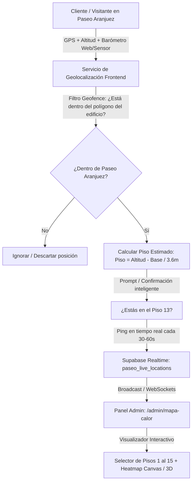

# 📍 Plan de Implementación: Mapa de Calor 3D en Tiempo Real por Pisos (Paseo Aranjuez)

> **Módulo:** Heatmap 3D & Tracking Tridimensional (Lat, Lon, Altitud / Pisos 1-15)  
> **Acceso:** Exclusivo Administradores (`/admin/mapa-calor`)  
> **Objetivo WOW:** Visualizar la afluencia de personas en tiempo real en cada uno de los ~15 pisos de la Torre Paseo Aranjuez y compilar la APK Android automáticamente con GitHub Actions.

---

## 🏗️ 1. Arquitectura General del Sistema



---

## 📐 2. Geofencing y Detección de Altura (Eje Z)

### A. Polígono del Edificio (Paseo Aranjuez, Cochabamba)
Se define el área perimetral del edificio (Avenida América y adyacentes) mediante coordenadas geográficas:
* **Latitud base:** `-17.375...`
* **Longitud base:** `-66.155...`
* **Algoritmo Point-in-Polygon (Ray Casting):** Si la coordenada enviada no cae dentro de la caja del edificio, no se almacena en la tabla del mapa de calor para proteger la privacidad fuera del mall.

### B. Fórmula de Cálculo de Piso por Altura Relativa
La altura base sobre el nivel del mar en Cochabamba es de aprox. **2,570 metros**. Cada piso de la torre comercial/corporativa tiene un promedio de **3.5 a 3.8 metros**:

$$\text{Piso Estimado} = \operatorname{clamp}\left(1, \; 15, \; \left\lfloor \frac{\text{Altitud Actual} - \text{Altitud Base}}{3.6} \right\rfloor + 1\right)$$

* **Método 1 (Barómetro / Presión Atmosférica):** Si el dispositivo móvil soporta `BarometerSensor` o la app nativa lee `Sensor.TYPE_PRESSURE`:
  $$\Delta h \approx 8.43 \times (\Delta \text{hPa})$$
* **Método 2 (GPS Vertical `coords.altitude`):** Con margen de tolerancia.
* **Micro-confirmación:** Si la app detecta un cambio de altura (ej: subió a piso superior), muestra un toast sutil:
  > *"Parece que estás en el Piso 13 (Gastronomía / Terraza). ¿Es correcto? [Sí] [Cambiar]"*

---

## 🌐 2.1. Viabilidad en Versión Web vs. APK Android Nativa

¿Se puede obtener Altitud (Z), Latitud (Y) y Longitud (X) directamente desde la Web sin instalar nada? **SÍ, está soportado en los estándares web**, pero con diferencias operativas frente a una APK nativa:

### A. Implementación en la Web (HTML5 Geolocation API)
Los navegadores móviles modernos (Chrome en Android, Safari en iOS) soportan la lectura tridimensional si se activa la alta precisión:

```javascript
navigator.geolocation.getCurrentPosition(
  (position) => {
    const lat = position.coords.latitude;          // Eje Y (Latitud)
    const lon = position.coords.longitude;         // Eje X (Longitud)
    const alt = position.coords.altitude;          // Eje Z (Metros sobre el mar, o null)
    const precisionZ = position.coords.altitudeAccuracy; // Margen de error vertical

    console.log(`Posición 3D: Lat ${lat}, Lon ${lon}, Altura: ${alt}m (±${precisionZ}m)`);
  },
  (error) => console.error("Error GPS:", error),
  { 
    enableHighAccuracy: true, // ⚠️ CRUCIAL: Fuerza el encendido del sensor de altitud/GNSS
    timeout: 15000,
    maximumAge: 0
  }
);
```

### B. Matriz Comparativa: Web vs. APK Android Nativa

| Característica | Versión Web (PWA / Chrome) | Versión APK (Android Nativo / Capacitor) |
|---|---|---|
| **Latitud & Longitud (X, Y)** | ✅ 100% Preciso (GPS + Wi-Fi) | ✅ 100% Preciso |
| **Altitud (Eje Z)** | 🟡 Soporta `coords.altitude`, pero si el usuario está en el centro del edificio o sótano sin satélites puede retornar `null`. | ✅ Lectura directa del **Barómetro físico** (`Sensor.TYPE_PRESSURE`). Funciona en cualquier rincón. |
| **Ejecución en Background** | ❌ El navegador suspende el GPS si se apaga la pantalla o cambia de app. | ✅ Corre en segundo plano (Background Service con el celular en el bolsillo). |
| **Acceso a Sensores** | 🟡 Sujeto a permisos de Chrome y HTTPS. | ✅ Acceso nativo total a hardware sin restricciones de navegador. |

### C. Estrategia Híbrida para la Web (100% Confiable)
Para garantizar que la versión web funcione sin importar el modelo de celular:
1. **Paso Automático:** La web solicita ubicación con `enableHighAccuracy: true`. Si `coords.altitude` viene con valor, calcula el piso directamente.
2. **Paso de Respaldo Inteligente (Fallback):** Si `coords.altitude` es `null` (común bajo techos gruesos de cemento), la web valida que está en el Paseo Aranjuez por Lat/Lon y despliega un micro-modal de 1 toque:
   > *"Bienvenido a Torre Aranjuez 🏢 ¿En qué piso te encuentras? [P1] [P2] [P3] ... [P15]"*
3. Una vez confirmado, la posición se sincroniza en Supabase y el mapa de calor del Administrador se actualiza en vivo.

---

## 🗃️ 3. Base de Datos en Supabase (`paseo_live_locations`)

```sql
CREATE TABLE paseo_live_locations (
  id UUID PRIMARY KEY DEFAULT gen_random_uuid(),
  session_id TEXT NOT NULL,         -- Hash anónimo o user_id si está logueado
  floor INT NOT NULL DEFAULT 1,     -- Piso: 1 al 15
  latitude DOUBLE PRECISION NOT NULL,
  longitude DOUBLE PRECISION NOT NULL,
  accuracy FLOAT,
  altitude FLOAT,
  is_confirmed BOOLEAN DEFAULT FALSE,
  updated_at TIMESTAMPTZ DEFAULT NOW()
);

-- Índice geoespacial y por piso para consultas ultrarrápidas
CREATE INDEX idx_locations_floor ON paseo_live_locations(floor);
CREATE INDEX idx_locations_updated ON paseo_live_locations(updated_at);

-- Limpieza automática de posiciones con más de 10 minutos de inactividad
CREATE OR REPLACE FUNCTION clean_stale_locations() RETURNS void AS $$
BEGIN
  DELETE FROM paseo_live_locations WHERE updated_at < NOW() - INTERVAL '10 minutes';
END;
$$ LANGUAGE plpgsql;
```

---

## 🖥️ 4. Visualización en Panel Admin (`/admin/mapa-calor`)

### Interfaz del Administrador:
1. **Selector de Pisos Interactivo (Pisos 1 al 15):**
   * Botonera vertical tipo ascensor con indicador de cantidad de gente en vivo por piso.
   * Resumen global: *"245 personas en el edificio — Piso más concurrido: Piso 2 (Comida) con 84 personas"*.
2. **Lienzo de Calor (Heatmap Layer):**
   * Plano arquitectónico 2D del piso seleccionado como fondo SVG/Canvas.
   * Renderizado de densidad de calor con `simpleheat` o `leaflet-heatmap` (puntos verdes, amarillos y rojos según concentración de personas).
3. **Modo Torre 3D (Opcional WOW):**
   * Modelo isométrico con Three.js mostrando las 15 placas de los pisos iluminándose con gradientes según su afluencia.

---

## 📱 5. Fase Móvil: APK Android con Capacitor + GitHub Actions CI/CD

Una vez validada la versión web, empaquetamos el proyecto en una aplicación nativa Android para tener acceso al 100% de los sensores de hardware (GPS en segundo plano y barómetro físico sin restricciones de navegador).

### A. Integración con Capacitor
```bash
npm install @capacitor/core @capacitor/cli @capacitor/android
npx cap init "Paseo Aranjuez" "com.paseoaranjuez.app"
npx cap add android
npm install @capacitor/geolocation
```

### B. Pipeline Automatizado de GitHub Actions (`.github/workflows/build-apk.yml`)
Cada vez que hagamos `git push` o activemos el workflow manualmente en GitHub, compila la APK en la nube y entrega el instalable listo para probar:

```yaml
name: Compilar APK Android - Paseo Aranjuez

on:
  workflow_dispatch: # Permite compilar con 1 clic manual en GitHub
  push:
    tags:
      - 'v*'

jobs:
  build:
    runs-on: ubuntu-latest
    steps:
      - name: Descargar Código
        uses: actions/checkout@v4

      - name: Instalar Node.js
        uses: actions/setup-node@v4
        with:
          node-version: 20
          cache: 'npm'

      - name: Instalar Dependencias
        run: npm ci

      - name: Build Web Next.js
        run: npm run build

      - name: Sincronizar Capacitor con Android
        run: npx cap sync android

      - name: Configurar Java JDK 17
        uses: actions/setup-java@v4
        with:
          distribution: 'zulu'
          java-version: 17

      - name: Compilar APK con Gradle
        run: |
          cd android
          ./gradlew assembleDebug

      - name: Subir APK como Artefacto de Descarga
        uses: actions/upload-artifact@v4
        with:
          name: PaseoAranjuez-Debug.apk
          path: android/app/build/outputs/apk/debug/app-debug.apk
```

---

## ⏱️ 6. Fases de Ejecución Paso a Paso

| Fase | Tarea Principal | Entregable |
|:---:|---|---|
| **Fase 1** | **Base de Datos & API** | Tabla `paseo_live_locations`, limpieza cron y API `/api/paseo/location` |
| **Fase 2** | **Captura de Cliente & Geofence** | Hook React `useUserFloorLocation()` con validación dentro de Paseo Aranjuez |
| **Fase 3** | **Panel Admin Heatmap** | Vista `/admin/mapa-calor` con selector de 15 pisos y mapa de calor dinámico |
| **Fase 4** | **Configuración Capacitor & APK** | Carpeta `/android` y workflow `.github/workflows/build-apk.yml` listo |
| **Fase 5** | **Prueba de Campo** | Subir en el ascensor de Paseo Aranjuez y verificar la detección de piso |
